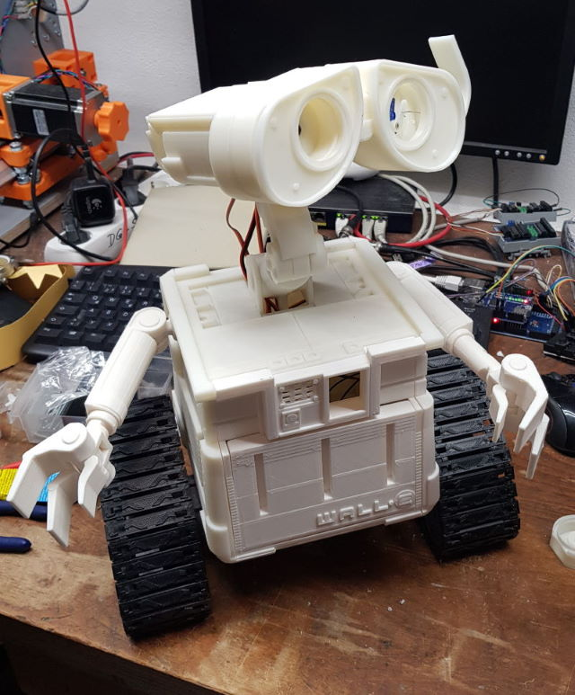
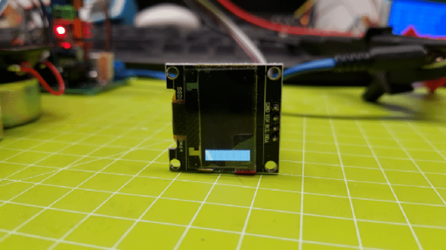
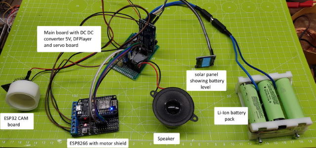

# Wall-E
 3d printed WALL-E controller

## Description: This project is a remix part of the Wall-E replica of chillibasket
https://www.thingiverse.com/chillibasket
I changed the electronic parts to one ESP32-CAM and one ESP8266 board.
The ESP32-CAM works as access-point and streaming server. The ESP8266
connect to the ESP32-CAM as Wifi client. The ESP8266 controls the Wall-E
motors, servos and sound-module. The Wall-E are controllable through a web
interface from any browser who connects to the accesspoint of the Wall-E.
You have to connect to the Wall-E SID with the password 1234. After successful 
connection you have to open a browser with the ip-address 192.168.4.200
You will see a homepage with the streaming live video picture and a touch controller
to control the Wall-E. Some additional buttons can be configured in source code for your
own functions. See code "void handleFunktion1()" for more functions.
                 
## Info:        This code is not final. The code actually missing the servo part. There are example of servo control in code. 
The following functions are realized and ready to run:
- full control of motors in all directions   
- sound effects   
- Wifi   
- Camera streaming   

Feel free to add functions and do a pull request!

## Battery indicator

## ToDo:        
- store the min and max values of servo motors in EEPROM   
- Page for setup of servo values to store in EEPROM   
- animations for Wall-E   
- adding functions to web-site   
             
## Hardware:    
- ESP8266   
- Motorshield for ESP8266   
- I2C Display SED   
- ESP32-CAM				
- Step-down converter from 12V to 5V (servo supply, DFPlayer and ESP VCC)   
- LiIo pack with balance board   

## Changelog:
### Date:         20200121
### Modified:     Initial Version 1.0

### Author:       
Eisbaeeer, https://github.com/Eisbaeeer               
URL: http://www.weimars.net/?page_id=362
URL: https://www.thingiverse.com/thing:4069116
 
## LICENSE: 		MIT License